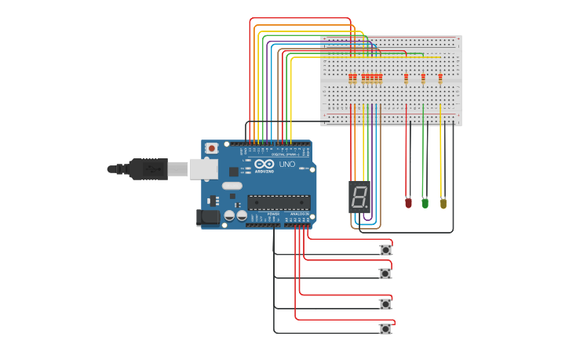

# ***Primer parcial S.P.D***

### **INTEGRANTE/DIVISIÓN:**
___
* Avila Valentin / J
___
### **PROYECTO:** *Montacarga.*
___

___
### **DESCRIPCIÓN**
___
* Se nos pidio armar un montacarga funcional como maqueta para un hospital. El objetivo es implementar un sistema que pueda recibir ordenes de subir, bajar o pausar desde diferentes pisos y muestre el estado actual del montacargas.
___
### **FUNCIONALIDAD**
___
* En este proyecto utilicé un display 7 segmentos para simular una pantalla en la que te van diciendo el piso en el que se encuentra. Tambie use 4 lamparitas led, uno para avisar cuando el montacarga esta en movimiento (verde), otro para cuando esta en pausa (rojo) y uno para cuando hay una emergencia (amarillo). 
Por ultimo, use cuatro pulsadores para recrear el sistema de un montacarga. Dos para que el movimiento del montacarga, uno para subir y el otro para bajar. Y dos para detener el movimiento, es decir, frenar el sistema, uno que detiene el montacarga a eleccion propia, y otro que frena el sistema y avisa que hubo un error en el sistema.
___
### **CODIGO**
~~~~
//Avila Valentin. División: 1J

int A = 11;
int B = 10;
int C = 9;
int D = 8;
int E = 7;
int F = 12;
int G = 13;
int pausa = 6;
int movimiento = 5;
int emergencia = 4;
int boton_bajar = A3;
int boton_frenar = A4;
int boton_subir = A5;
int boton_emergencia = A2;
int piso = 0;
bool flag_subida = false;
bool flag_bajada = false;
bool flag_emergenciia = false;

void setup(){
    pinMode(A, OUTPUT); 
    pinMode(B, OUTPUT);
    pinMode(C, OUTPUT); 
    pinMode(D, OUTPUT);
    pinMode(E, OUTPUT);
    pinMode(F, OUTPUT);
    pinMode(G, OUTPUT);
    pinMode(pausa, OUTPUT); 
    pinMode(movimiento, OUTPUT);
  	pinMode(emergencia, OUTPUT);
    pinMode(boton_bajar, INPUT_PULLUP);
    pinMode(boton_frenar, INPUT_PULLUP);
    pinMode(boton_subir, INPUT_PULLUP);
    pinMode(boton_emergencia, INPUT_PULLUP);
    Serial.begin(9600);
}

void prender_led(int led){
  digitalWrite(led, 1);
}

void apagar_led(int led){
  digitalWrite(led, 0);
}

void mostar_piso(int x){
  	if(x == 0){
      prender_led(A);
      prender_led(B);
      prender_led(C);
      prender_led(D);
      prender_led(E);
      prender_led(F);
      apagar_led(G);
  }
   	else  if(x == 1){
      apagar_led(A);
      prender_led(B);
      prender_led(C);
      apagar_led(D);
      apagar_led(E);
      apagar_led(F);
      apagar_led(G);
    }
    else if(x == 2){
      prender_led(A);
      prender_led(B);
      apagar_led(C);
      prender_led(D);
      prender_led(E);
      apagar_led(F);
      prender_led(G);
    }
    else if(x == 3){
      prender_led(A);
      prender_led(B);
      prender_led(C);
      prender_led(D);
      apagar_led(E);
      apagar_led(F);
      prender_led(G);
    }
    else if(x == 4){
      apagar_led(A);
      prender_led(B);
      prender_led(C);
      apagar_led(D);
      apagar_led(E);
      prender_led(F);
      prender_led(G);
    }
  delay(500);
}

void sistema_detenido(){
  	int estado_boton_frenar = digitalRead(boton_frenar);
  	int estado_boton_emergencia = digitalRead(boton_emergencia);
    if(estado_boton_frenar == 0){
       Serial.println("El montacarga esta detenido");
       apagar_led(movimiento);
       prender_led(pausa);
       flag_subida = false;
       flag_bajada = false;
    }
     else if(estado_boton_emergencia == 0 || flag_emergenciia == true){
       	  flag_emergenciia = true;
          Serial.println("Hubo un error en el sistema, ya se aviso a los de mantenimiento");
          apagar_led(movimiento);
          prender_led(pausa);
          prender_led(emergencia);
          delay(500);
          apagar_led(emergencia);
          delay(500);
       	  flag_subida = false;
          flag_bajada = false;
  }
}

void sistema_funcionando(){
	int estado_boton_subir = digitalRead(boton_subir);
  	int estado_boton_bajar = digitalRead(boton_bajar);
    if(estado_boton_subir == 0 || flag_subida==true){
       delay(1500);
       if(piso <= 4){
         flag_emergenciia = false;
         flag_subida=true;
         Serial.println("El montacarga esta en movimiento");
         prender_led(movimiento);
         apagar_led(pausa);
         piso++;
         mostar_piso(piso);
         delay(1500);
       }
      else{
         flag_subida=false;
         apagar_led(movimiento);
         apagar_led(pausa);
      }
    }
    else if(estado_boton_bajar == 0 || flag_bajada==true){
       delay(1500);
       if(piso >= 1){
         flag_emergenciia = false;
         flag_bajada=true;
         Serial.println("El montacarga esta en movimiento");
         prender_led(movimiento);
         apagar_led(pausa);
         piso--;
         mostar_piso(piso);
         delay(1500);
       }
      else{
         flag_bajada=false;
         apagar_led(movimiento);
         apagar_led(pausa);
      }
    }
}

void loop(){ 
  	Serial.println("Estas en el piso: ");
    Serial.println(piso);
    mostar_piso(piso);
    sistema_detenido();
    sistema_funcionando();   
}
~~~~
___
### **LINK DEL PROYECTO**
___
[PROYECTO](https://www.tinkercad.com/things/f0RtdIe6JPc-montacarga-para-un-hospital/editel?sharecode=Q789leCgAdzeMd_Gkn4Ag6Umj_DQal_8kVL8IKmkw1o)
